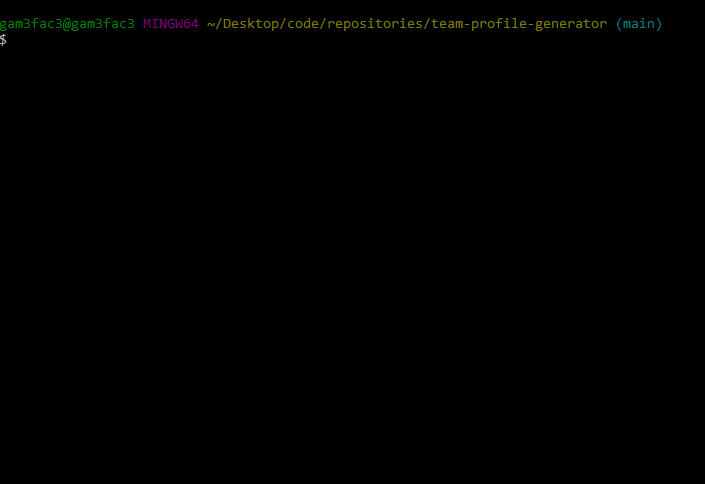
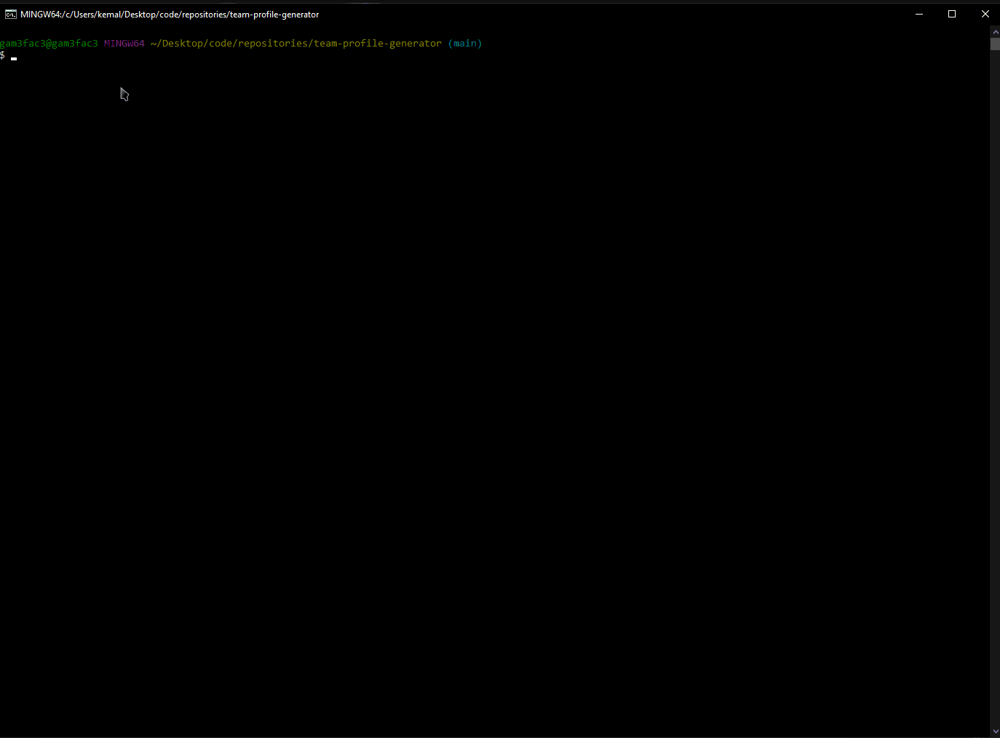
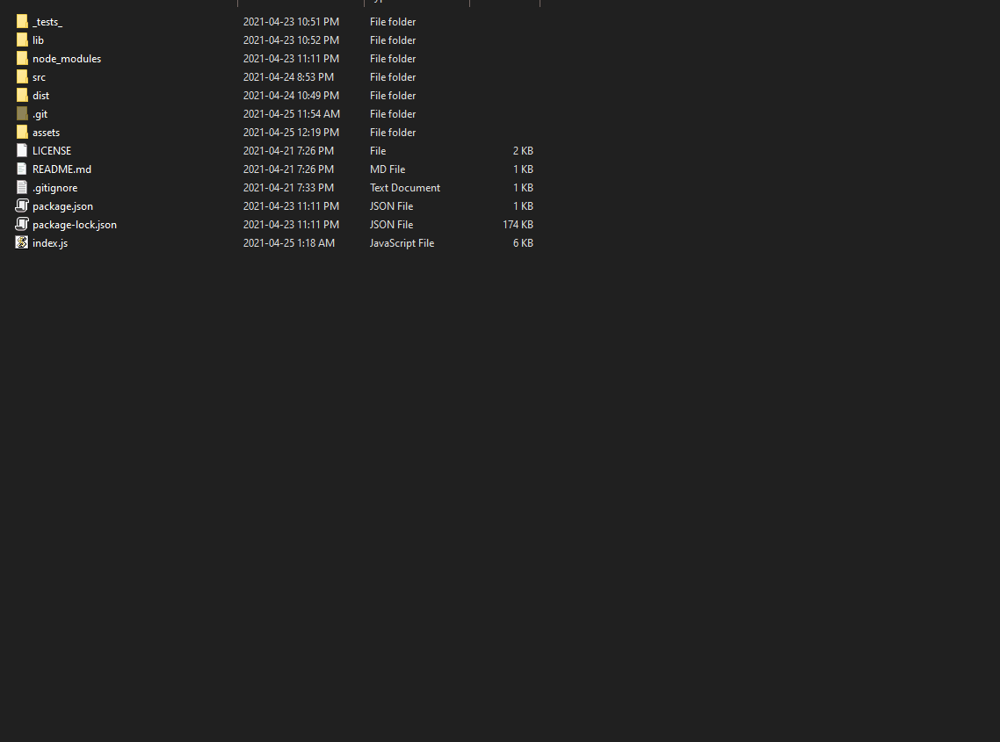
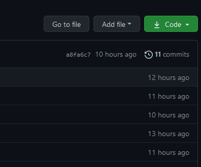
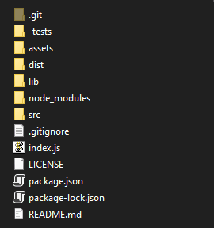

# Team Profile Generator

### About:
This is a software engineering team generator application that creates new members depending on their position in the team. It can generate an infinite amount of members while still maintaining the structure of the `HTML` webpage its being displayed. The application runs on `Node.js` and also uses the `Inquirer`, `fs` and `colors` modules.\
The main purpose of this application was to implement `OOP`(Object Oriented Programming) with using classes and keeping the file structure organized while using the `jest` framework to test these classes.\
There are 4 main classes and 33 tests that check these classes.

- *Employee.test.js*
- *Manager.test.js*
- *Engineer.test.js*
- *Intern.test.js*

### Tests:


### Demo:


### Webpage:


### Installation:
1. Clone this repository\

2. Run the following commands in the main directory:
```bash
npm install
```
3. To start the program:
```bash
node index.js
```
4. To run the tests:
```bash
npm test
```
5. After entering all the required information, the generated `HTML` will be in the `dist` directory named <ins>generatedTeam.html</ins>\


### Usage:
1. After starting the application, please first enter if you would like to add a Manager to your team.
    - If yes, complete the questions regarding the Manager.
    - If no, continue with the other members.
2. Select the next employee you would like to add to the team.
    - If Engineer is selected,
        - Enter the information regarding the Engineer.
    - If Intern is selected,
        - Enter the information regarding the Intern.
3. Continue the process until the whole team is added.
4. The process can be ended whenever the option to select the new member is present.

### Improvements:
> This is my first time creating tests and using classes in `Node.js`. The structure of the program and the tests could be improvised and adjusted even better. Other member types and additional information can also be implemented.

### License:
Copyright © Kemal Demirgil. All rights reserved.
Licensed under the [MIT](https://github.com/kemaldemirgil/team-profile-generator/blob/main/LICENSE) license.
